<div align="center">
  
</div>

<div align="center">
  
[](https://git.io/typing-svg)

</div>

<div align="center">
  
  
</div>

---

## 🚀 About Me

```python
class AIEngineer:
    def __init__(self):
        self.name = "Mostafa Abdo El-Gohary"
        self.role = "AI Engineer & Machine Learning Specialist"
        self.location = "Egypt 🇪🇬"
        self.interests = [
            "Computer Vision",
            "Natural Language Processing",
            "Large Language Models (LLMs)",
            "Generative AI",
            "Deep Learning",
            "Machine Learning"
        ]
        self.current_focus = "Building intelligent systems"
        self.life_goal = "Ease life for everyone through AI"
    
    def say_hi(self):
        print("Thanks for dropping by! Let's build something amazing together.")

me = AIEngineer()
me.say_hi()
```

<details>
<summary><b>🎯 Current Goals & Learning Path</b></summary>
<br>

- 🔭 Currently working on **Advanced Computer Vision Projects**
- 🌱 Learning **Transformer Architectures** and **Generative AI**
- 👯 Looking to collaborate on **Open Source AI Projects**
- 💡 Exploring **MLOps** and **Model Deployment**
- 📫 Open to **Research Opportunities** and **Collaborations**
- ⚡ Fun fact: **I debug with print statements and I'm proud of it!**

</details>

---

## 🛠️ Tech Stack & Skills

<div align="center">

### 💻 Programming Languages


### 🤖 AI/ML Frameworks & Libraries


### 📊 Data Science & Analytics


### 🌐 Web Development


### 🗄️ Databases & Tools


### 🔧 IDEs & Editors


### ⚙️ Hardware & Embedded Systems


</div>

---

## 📊 GitHub Statistics

<div align="center">
  
### 📈 Overall Stats & Streak
  
<table>
  <tr>
    <td>
      
    </td>
    <td>
      
    </td>
  </tr>
</table>

### 💻 Most Used Languages & Contributions

<table>
  <tr>
    <td width="50%">
      
    </td>
    <td width="50%">
      
    </td>
  </tr>
</table>

### 📊 Contribution Activity Graph


</div>

---

## 🏆 GitHub Trophies

<div align="center">
  
</div>

---

## 🎓 Skills Matrix

<table align="center">
  <tr>
    <td align="center" width="200">
      
      <br><b>Python</b>
      <br>⭐⭐⭐⭐⭐
    </td>
    <td align="center" width="200">
      
      <br><b>C++</b>
      <br>⭐⭐⭐⭐
    </td>
    <td align="center" width="200">
      
      <br><b>Deep Learning</b>
      <br>⭐⭐⭐⭐⭐
    </td>
    <td align="center" width="200">
      
      <br><b>MySQL</b>
      <br>⭐⭐⭐⭐
    </td>
  </tr>
  <tr>
    <td align="center" width="200">
      
      <br><b>Computer Vision</b>
      <br>⭐⭐⭐⭐⭐
    </td>
    <td align="center" width="200">
      
      <br><b>TensorFlow</b>
      <br>⭐⭐⭐⭐
    </td>
    <td align="center" width="200">
      
      <br><b>PyTorch</b>
      <br>⭐⭐⭐⭐
    </td>
    <td align="center" width="200">
      
      <br><b>JavaScript</b>
      <br>⭐⭐⭐
    </td>
  </tr>
</table>

---

## 🎯 AI/ML Expertise

<div align="center">

| Domain | Technologies | Proficiency |
|:------:|:------------:|:-----------:|
| **Computer Vision** | OpenCV, YOLO, CNNs, Image Processing | ████████████ 95% |
| **Natural Language Processing** | Transformers, BERT, NLP Pipelines | ███████████░ 85% |
| **Deep Learning** | Neural Networks, GANs, Autoencoders | ████████████ 90% |
| **Machine Learning** | Scikit-learn, Feature Engineering, Model Optimization | ████████████ 92% |
| **Data Analysis** | Pandas, NumPy, Statistical Analysis | ████████████ 95% |
| **Model Deployment** | Flask, FastAPI, Docker | ████████░░░░ 70% |

</div>

---

## 💼 What I'm Working On

```mermaid
%%{init: {'theme':'dark', 'themeVariables': { 'primaryColor':'#ff6e96','primaryTextColor':'#fff','primaryBorderColor':'#00d9ff','lineColor':'#00d9ff','secondaryColor':'#7c3aed','tertiaryColor':'#1e293b','fontSize':'16px','fontFamily':'Segoe UI'}}}%%
graph TB
    A[AI & ML Engineering Projects]
    
    A --> B[Computer Vision]
    A --> C[Natural Language Processing]
    A --> D[Deep Learning & Neural Networks]
    A --> E[Generative AI]
    
    B --> B1[Object Detection & Tracking]
    B --> B2[Image Segmentation]
    B --> B3[Facial Recognition]
    
    C --> C1[Text Classification]
    C --> C2[Named Entity Recognition]
    C --> C3[Sentiment Analysis]
    
    D --> D1[CNN Architectures]
    D --> D2[Model Optimization]
    D --> D3[Transfer Learning]
    
    E --> E1[Large Language Models]
    E --> E2[GANs & Image Generation]
    E --> E3[AI Chatbots]
    
    style A fill:#ff6e96,stroke:#00d9ff,stroke-width:3px,color:#fff
    style B fill:#7c3aed,stroke:#00d9ff,stroke-width:2px,color:#fff
    style C fill:#7c3aed,stroke:#00d9ff,stroke-width:2px,color:#fff
    style D fill:#7c3aed,stroke:#00d9ff,stroke-width:2px,color:#fff
    style E fill:#7c3aed,stroke:#00d9ff,stroke-width:2px,color:#fff
```

<div align="center">



</div>

---

## 🌟 Featured Projects

<div align="center">
  <a href="https://github.com/mostafaabdoelgohary2003AI?tab=repositories">
    
  </a>
</div>

---

## 📝 Latest Blog Posts & Articles

<!-- BLOG-POST-LIST:START -->
- 🧠 Exploring Deep Learning Architectures
- 👁️ Computer Vision: From Theory to Practice
- 🤖 Building Intelligent Systems with AI
- 📊 Data Science Best Practices
<!-- BLOG-POST-LIST:END -->

---

## 📬 Connect With Me

<div align="center">

[](https://www.linkedin.com/in/mostafa-abdo-el-gohary-2003ai)
[](https://github.com/mostafaabdoelgohary2003AI)
[](https://kaggle.com/mostafaabdoelgohary2003AI)
[](mailto:your.email@example.com)
[](https://yourportfolio.com)

</div>

---

## 💡 Random Dev Quote

<div align="center">
  


</div>

---

## 🐍 Contribution Snake

<div align="center">
  
</div>

---

## 📈 Activity Graph

<div align="center">
    
</div>

---

## 🎨 Profile Summary Cards

<div align="center">
  
  
  
  
</div>

---

<div align="center">

### 💭 Quote of the Day
  
*"Artificial Intelligence is the new electricity."* - **Andrew Ng**

### ✨ Show some ❤️ by starring some of my repositories!

</div>

---

<div align="center">
  
</div>

